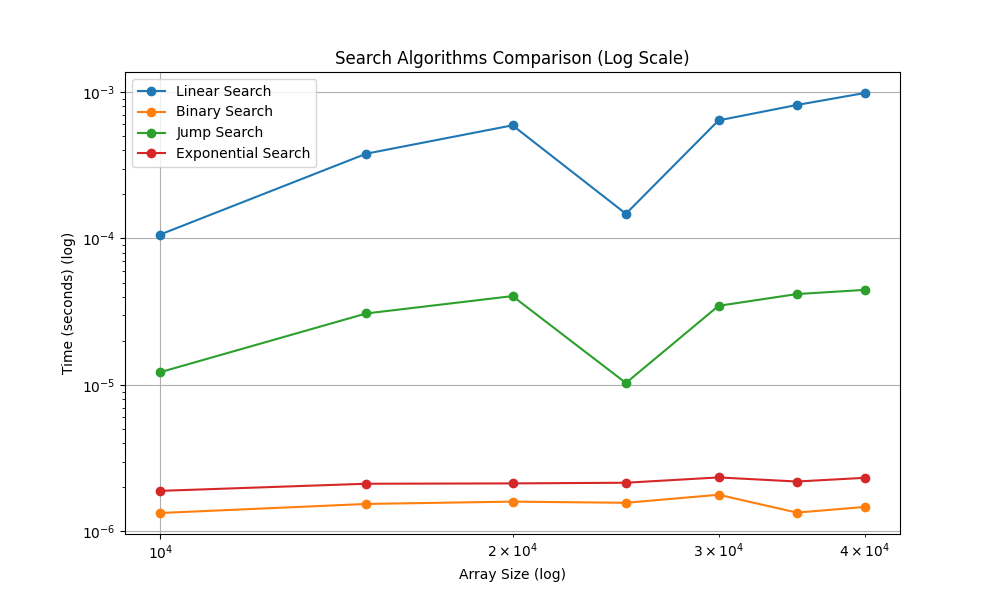
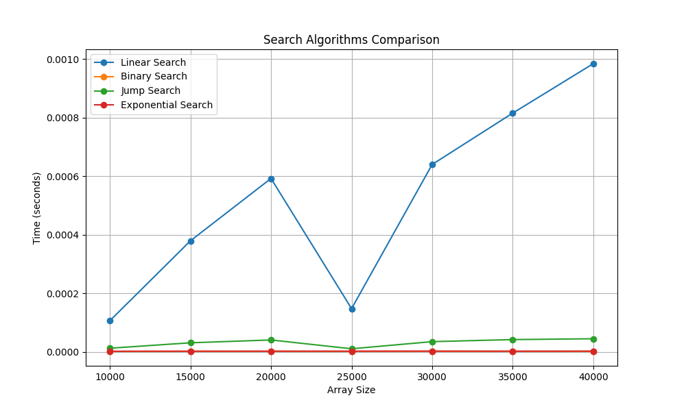

# Search Algorithms Analysis

### Author: [Diego Cardenas](github.com/diegcard)
### Institution: Escuela Colombiana de Ingeniería Julio Garavito
### Professor: [Rafael Niquefa](github.com/niquefa)
### Signature: Algoritmo y Representación de Datos

## Introduction

This project analyzes common search algorithms, their complexity, and performance. The algorithms studied are:

* Linear Search
* Binary Search
* Jump Search
* Exponential Search

## Running locally and testing

* Instructions for mac (Windows/Linux may require adjustments)
* Recommended: Use a virtual environment with [virtualenv](https://virtualenv.pypa.io/en/latest/)
* Create virtualenv: `virtualenv env`
* Activate: `source env/bin/activate`
* Install dependencies: `pip install -r requirements.txt`
* Run: `python app.py`

## Python version

Python 3.11.0

## Algorithms

### Linear Search
A simple search algorithm that checks each element sequentially until a match is found or the list ends.
* Worst-case: O(n)
* Best-case: O(1)
* Average-case: O(n)

### Binary Search
An efficient algorithm for sorted arrays that repeatedly divides the search interval in half.
* Worst-case: O(log n)
* Best-case: O(1)
* Average-case: O(log n)
* Prerequisite: Array must be sorted

### Jump Search
Searches sorted arrays by jumping ahead by fixed steps and then performing linear search.
* Worst-case: O(√n)
* Best-case: O(1)
* Average-case: O(√n)
* Prerequisite: Array must be sorted

### Exponential Search
Searches sorted arrays by exponentially increasing the search range until exceeding the target.
* Worst-case: O(log n)
* Best-case: O(1)
* Average-case: O(log n)
* Prerequisite: Array must be sorted

## Graphs
Graphs generated using matplotlib show execution time vs array size:
* X-axis: Array size
* Y-axis: Time (seconds)

## Conclusion
Binary Search and Exponential Search perform best with O(log n) complexity for sorted arrays. Linear Search is simplest but least efficient with O(n) complexity.

## Coverage
Install coverage: `pip install -r requirements.txt`
Run: `coverage run -m unittest discover`
Report: `coverage report`

Size | Linear | Binary | Jump | Exponential
--------------------------------------------------
 10000 |     10 |      0 |      1 |      0
 20000 |      8 |      0 |      0 |      0
 30000 |      2 |      0 |      0 |      0
 40000 |     25 |      0 |      1 |      0
 50000 |     63 |      0 |      2 |      0

## Code Formatting
Use: `black . -l 120` (requires black installed)