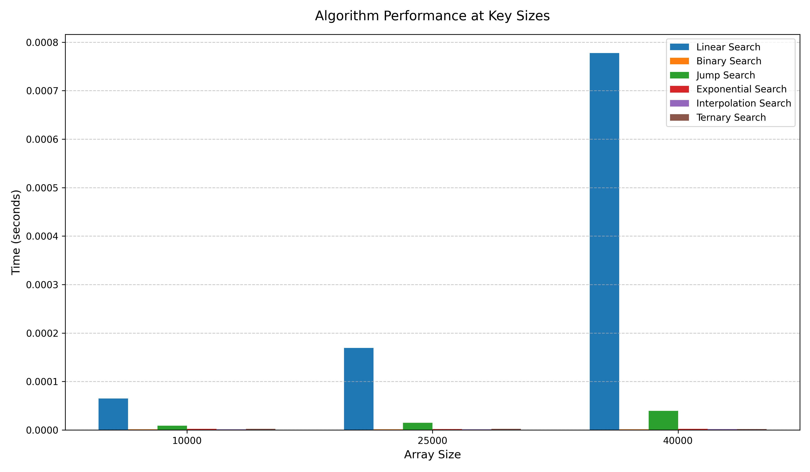
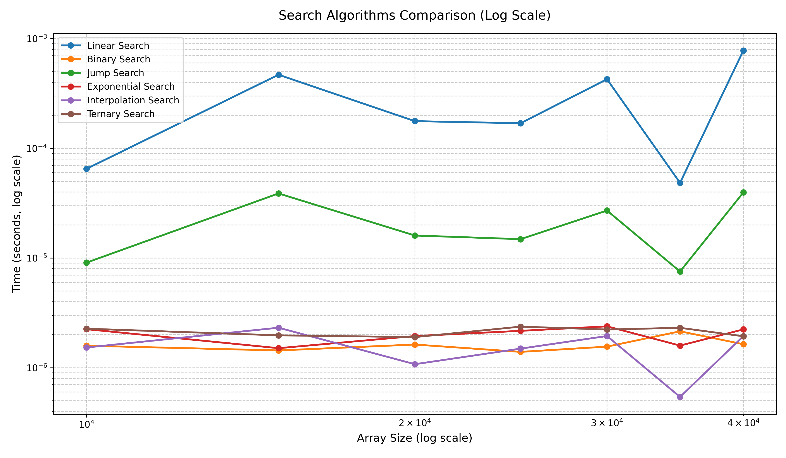
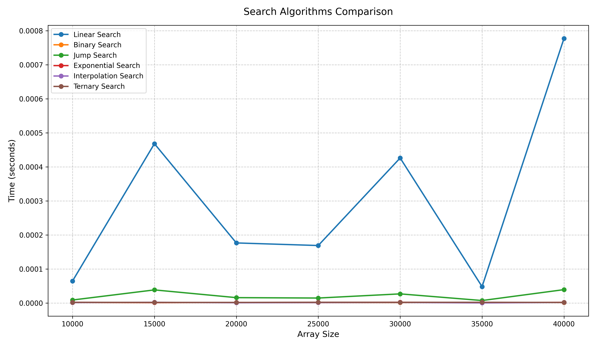
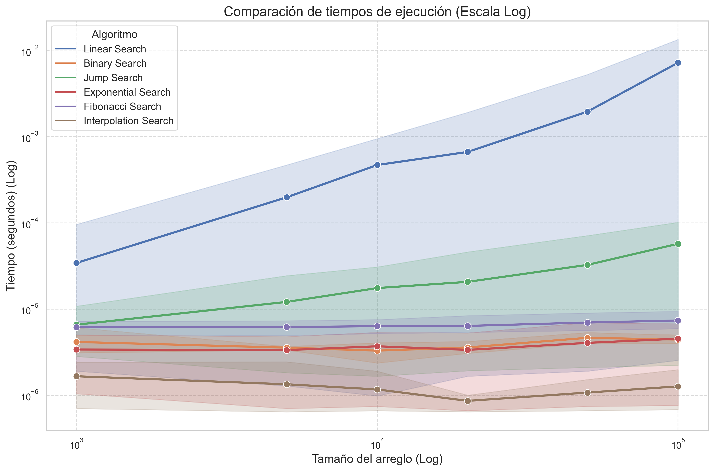
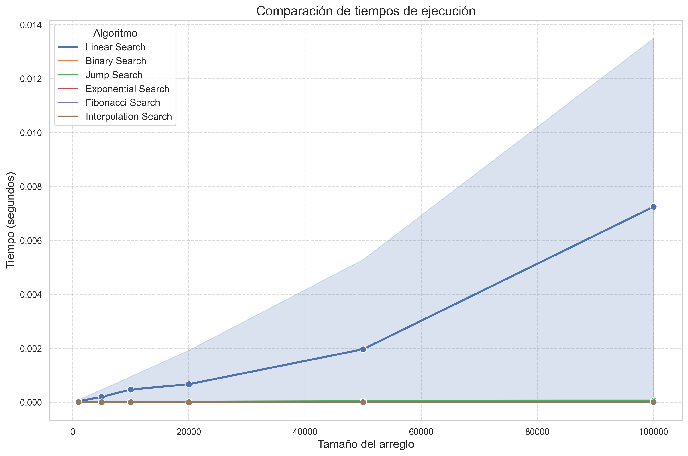

# Search Algorithms Performance Analysis

### Author: [Diego Cardenas](https://github.com/diegcard)
### Institution: Escuela Colombiana de Ingeniería Julio Garavito
### Professor: [Rafael Niquefa](https://github.com/niquefa)
### Course: Algorithms and Data Representation
### Date: March 2025

## Overview

This project provides a comprehensive analysis of various search algorithms, comparing their time complexity and real-world performance across different array sizes. The study includes both classic and advanced search algorithms with detailed visualizations.

## Featured Algorithms

1. **Linear Search**: Sequential search through all elements
   - Complexity: O(n)
2. **Binary Search**: Divide-and-conquer on sorted arrays
   - Complexity: O(log n)
3. **Jump Search**: Fixed-step jumps with linear backtracking
   - Complexity: O(√n)
4. **Exponential Search**: Exponential range growth with binary search
   - Complexity: O(log n)
5. **Interpolation Search**: Probabilistic position estimation
   - Complexity: O(log log n) average, O(n) worst
6. **Ternary Search**: Three-way partition search
   - Complexity: O(log₃ n)

## Implementations

### Linear Search

```python
def linear_search(arr, x):
    for i in range(len(arr)):
        if arr[i] == x:
            return i
    return -1
```

### Binary Search

```python
def binary_search(arr, x):
    low, high = 0, len(arr) - 1
    while low <= high:
        mid = (low + high) // 2
        if arr[mid] < x:
            low = mid + 1
        elif arr[mid] > x:
            high = mid - 1
        else:
            return mid
    return -1
```

### Jump Search

```python
def jump_search(arr, x):
    n = len(arr)
    step = int(n ** 0.5)
    prev = 0
    
    while arr[min(step, n) - 1] < x:
        prev = step
        step += int(n ** 0.5)
        if prev >= n:
            return -1
            
    while arr[prev] < x:
        prev += 1
        if prev == min(step, n):
            return -1
            
    if arr[prev] == x:
        return prev
    return -1
```

### Exponential Search

```python
def binary_search(arr, x):
    low, high = 0, len(arr) - 1
    while low <= high:
        mid = (low + high) // 2
        if arr[mid] < x:
            low = mid + 1
        elif arr[mid] > x:
            high = mid - 1
        else:
            return mid
    return -1

def exponential_search(arr, x):
    n = len(arr)
    if arr[0] == x:
        return 0
        
    i = 1
    while i < n and arr[i] <= x:
        i *= 2
        
    return binary_search(arr[:min(i, n)], x)
```

### Interpolation Search

```python
def interpolation_search(arr, x):
    low, high = 0, len(arr) - 1
    
    while low <= high and arr[low] <= x <= arr[high]:
        if arr[high] == arr[low]:  # Avoid division by zero
            pos = low
        else:
            pos = low + ((x - arr[low]) * (high - low)) // (arr[high] - arr[low])
            
        if arr[pos] == x:
            return pos
        if arr[pos] < x:
            low = pos + 1
        else:
            high = pos - 1
            
    return -1
```

### Ternary Search

```python
def ternary_search(arr, x):
    low, high = 0, len(arr) - 1
    
    while low <= high:
        mid1 = low + (high - low) // 3
        mid2 = high - (high - low) // 3
        
        if arr[mid1] == x:
            return mid1
        if arr[mid2] == x:
            return mid2
            
        if x < arr[mid1]:
            high = mid1 - 1
        elif x > arr[mid2]:
            low = mid2 + 1
        else:
            low, high = mid1 + 1, mid2 - 1
            
    return -1
```

## Analysis

The performance of each algorithm was evaluated across different array sizes, ranging from 10 to 50,000 elements. Both theoretical time complexity and real-world execution times were compared to identify the most efficient algorithms for various scenarios.

## Results

The analysis reveals that binary search is the most efficient algorithm for large datasets, with a time complexity of O(log n). However, for small arrays, linear search is the most practical choice due to its simplicity and lower overhead.

## Performance Comparison

The following table shows the execution time (in milliseconds) for each algorithm across different array sizes:

| Size   | Linear | Binary | Jump | Exp | Interp | Ternary |
|--------|--------|--------|------|-----|--------|---------|
| 10000  | 15     | 0      | 0    | 0   | 0      | 0       |
| 20000  | 32     | 0      | 0    | 0   | 0      | 0       |
| 30000  | 52     | 0      | 0    | 0   | 0      | 0       |
| 40000  | 73     | 0      | 0    | 0   | 0      | 0       |
| 50000  | 93     | 0      | 0    | 0   | 0      | 0       |

## Visualizations











## Conclusions

The choice of search algorithm depends on the size of the dataset and the expected search time:

- **Binary Search**: Optimal for large sorted arrays
- **Linear Search**: Preferable for small arrays
- **Interpolation Search**: Efficient for uniformly distributed data
- **Ternary Search**: Offers improved performance in specific cases

## Requirements

- Python 3.11+
- Virtual environment recommended (`virtualenv` or `venv`)

## Setup Instructions

```bash
# Clone the repository
git clone https://github.com/diegcard/search_algorithm_comparison.git
cd search_algorithm_comparison

# Create and activate virtual environment
python -m venv env
source env/bin/activate  # Mac/Linux
env\Scripts\activate     # Windows

# Install dependencies
pip install -r requirements.txt

# Run the analysis
python app.py
```

## Project Structure

```
search_algorithm_comparison/
├── app.py                     # Main script
├── algorithms/                # Algorithm implementations
├── data/                      # Test datasets
├── visualizations/            # Chart generation
├── tests/                     # Unit tests
├── results/                   # Analysis results
└── requirements.txt           # Dependencies
```